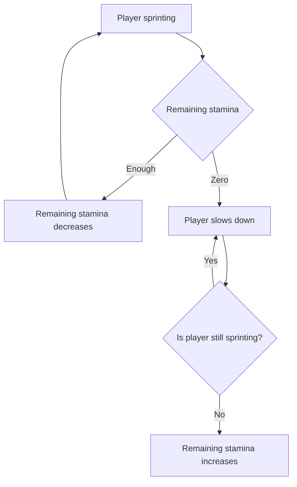

# Stamina System Specification

## Glossary

Stamina - amount of time that player can perform stamina-dependant actions like sprinting.

## Variables

- `stamina_time` - amount of stamina time.
- `stamina_remaining` - amount of remaining stamina time.
- `stamina_recovery` - rate of stamina recovery.
- `stamina_recovery_block` - flag that indicates whether to block stamina recovery.
- `stamina_slowness` - amount of time the player is slowed down.

## System

### Rules
1. When player do stamina-dependant action, `stamina_remaining` decreases until it reaches zero.
2. When `stamina_remaining` is zero, player gets slowness effect for `stamina_slowness` time.
3. When `stamina_remaining` is less than `stamina_time`, `stamina_remaining` increases according to `stamina_recovery` rate.
4. When `stamina_recovery_block` flag is active, rule 3 is disabled.

### Flowchart of Sprinting Player

